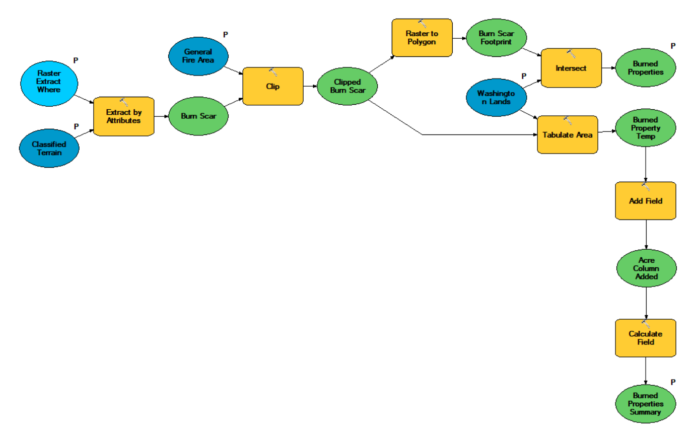

# The 2014 Carlton Complex Fire - An Ownership Analysis

[TOC]

## Introduction

This GIS project was completed as an assignment in course #4 of the [UC Davis/Coursera GIS Certificate](https://cpe.ucdavis.edu/section/geographic-information-systems-gis-specialization-coursera) program, [Imagery, Automation, and Applications](https://www.coursera.org/learn/gis-applications?specialization=gis).  The goal of the project was to demonstrate fundamental ArcGIS skills in the areas of remote sensing analysis, classification, dataset correlation, and building and executing automated tools.

## Background
The Methow Valley, situated in the north-central portion of Washington State, is a picturesque rural area, supported largely by agricultural, recreational, and tribal industries.  With a climate classification of dry-summer humid continental, the region only receives 12 inches of rain per year, far less than the Washington State average of 38 inches per year.   Situated on the drier side of the Cascade Mountains,  it is one of the more wildfire-prone regions of the state.

From July 14 to August 24, 2014, one of the largest fires in Washington State history ripped through the area, leaving over a quarter million acres burned and hundreds of homes, businesses, farms, and ranches destroyed.   Tragically, two people were killed as a result of the wildfire.

This project aims to identify the final destructive footprint of the fire and analyze the ownership of the land affected by the fire.  A project like this might be used for future fires to assist with coordination, cleanup, restoration, and prevention.  The project is designed to allow for any Landsat 8 imagary and is runtime-configurable so future Washington State fires can be analyzed.

## Methodology
Using Landsat 8 imagery acquired shortly after the fire, ArcMap supervised classification is used to identify the final footprint of the fire, as well as surrounding non-affected land and its associated type.   An automated workflow joins land ownership feature classes from the Washington State Department of Natural Resources in order to identify and quantify ownership of the land affected by the fire.

All processing steps are placed inside an automated workflow, which allows for any Washington State wildfire to be analyzed using this tool, utilizing user-modifiable runtime parameters. 

### Data Sources
Land ownership datasets are retrieved from the [Washington State DNR](https://data-wadnr.opendata.arcgis.com/).  Additionally, a simple Washington State boundary is used to constrain analysis of the Landsat 8 imagery.  All datasets are available as linked below.
* [WA DNR Managed Land Parcels](https://data-wadnr.opendata.arcgis.com/documents/wadnr::wa-dnr-managed-land-parcels-download/about) feature class
* [WA Major Public Lands (non-DNR)](https://data-wadnr.opendata.arcgis.com/documents/wadnr::wa-major-public-lands-non-dnr-download/about) feature class
* [Washington State Boundary](https://data-wadnr.opendata.arcgis.com/documents/wadnr::wa-state-boundary-download/about) feature class

A [Landsat 8](https://earthexplorer.usgs.gov/) 45/26 pass on 7/31/2014 provided a cloud free image of the freshly charred organic material.   This date represents a point in time which the fire footprint had nearly reached its final size and the 7/31/2014 pass provides a remarkably unobstructed view of the region.    Some subjective evaluation was done on the Earth Explorer site to find the candidate raster.   Subsequent passes in August and September did not provide such a clear view.   The footprint at next pass after the fully contained date of 8/24/2014 very closely matches the footprint of 7/31/2014, so this earlier date was chosen for the purpose of this project.    While the fire footprint is near the edge of this particular Landsat 8 raster, it did not extend into the next raster to any significant degree, so no mosaic processing was required.

### Data Preparation
#### Parcel Ownership Feature Classes
1. As an optimization, a feature class was manually digitized to the general region of the fire. This is simply a one row feature class with a polygon feature used to constrain the area of classification analysis so the entire Landsat 8 raster need not be processed and other non-Carlton fires are not included in the classification.
2. Using the merge tool, a new feature class ‘government lands’ was created by merging the two parcel ownership feature classes.   The field calculator was then used to statically populate the OWNER and MANAGER fields of this feature class for all DNR records.
3. The erase tool was used to generate a new feature class ‘private lands’ – all land which is within Washington state that is not part of the government_lands feature class.
4. Finally, the merge tool was used again to merge the government_lands and private_lands feature classes into an all_wa_lands feature class that contains land ownership information for the entire state in a standardized format.  Again the field calculator was used to statically populate ‘Private’ in the OWNER and MANAGER fields of the new private land records.  This is a reusable feature class which can be used for all future Washington State fires.

For reference, these feature classes generated in the data prepraration phase are included in this git repository.

#### Burn Scar Raster Band Mapping
Charred organic material has relatively low reflictivity on the visible spectrum, but rather high reflectivity in the short-wave infrared.  Additionally, healthy vegetation has a rather high reflectivity in the near infrared.  Remapping Landsat 8 bands as follows will result in the burn scar showing up as a highly distinct magenta, and healthy vegegation a distinct green, which will greatly assist in raster classification:

| Landsat 8 Band  | Mapped Color |
| ------------- | ------------- |
| 7 / SWIR 2 | Red  |
| 5 / NIR | Green  |
| 4 / Red | Blue  |

Prior to band mapping, the standard Landsat 8 pass does not easily identify the burn scar:

Once bands are remapped pursuant to the table above, the burn scar becomes readily visible.  The bright magenta area in the bottom of the raster represents the charred organic material and this transformed Landsat 8 pass is now ready for supervised classification:

#### Burn Scar Classification

Using the Supervised Classification feature of ArcMap, a new raster is created which contains a classification for charred organic material, denoted in red below.   Note that other satellite fires are also shown.    Most of these were a result of wind-blown embers, although it can also be assumed that in a fire-prone area, these could be smaller fires which occurred at a prior time.

### Parcel Identification Workflow
Parcel feature classes and the classified raster are now ready to be used as input parameters into the automated workflow which reports the various property owners and the respective acres burned in the Carlton Complex Fire.   This user-generated tool has been included in the repository for reference.

In summary this tool performs the following tasks, using the classified burn scar raster, parcel feature class, and general fire area feature class as input parameters.

1. Extracts a standalone burn scar raster from the post-classification raster using the extract by attribute tool.
2. Clips the burn scar raster to the known general area of the fire to exclude other charred areas which are not part of the Carlton Complex Fire.   This step is particularlarily important in fire-prone areas where prior fires have burned in outlying areas.
3. Converts the classified raster to a polygon for further processing
4. Creates a feature class of burned properties and their respective owners by intersecting the burn footprint with the land ownership feature class.
5. Summarizes the area burned by owner/manager by using the tabulate area tool.   This can then be used to create a summary pie chart in the map document.

## Results

The automated tool creates the following polygon feature class.   This feature class includes burn footprint and the owner of each affected parcel.   Overlaying this on a topographic map gives useful context.

The "Burned Properties" feature class has manually-added symbology:

In addition to this feature class, a summary table is also generated which totals the burned acres by manager.   This is useful for reporting and graphs.

Lastly, a one-page layout is created to package and present this information, including a horizontal bar graph to help the reader compare acreage totals.

## Project Artifacts

An exported map and a full map package are available in the [arcmap](./arcmap) directory of this project.  

The map package is also available on [ArcGIS Online](https://www.arcgis.com/home/item.html?id=af7f3cbbec0e44ac974ecde214e01bd5)

Source data can be accessed as S3 objects in the project bucket:

[Landsat 8 raster](https://carlton-complex-fire.s3.us-west-2.amazonaws.com/LC08_L2SP_045026_20140731_20200911_02_T1.tar)

[WA state boundary](https://carlton-complex-fire.s3.us-west-2.amazonaws.com/WA_State_Bndy.zip)

[DNR-managed parcels](https://carlton-complex-fire.s3.us-west-2.amazonaws.com/WA_DNR_Managed_Land_Parcels.zip)

[Non-DNR managed parcels](https://carlton-complex-fire.s3.us-west-2.amazonaws.com/state_ndmpl.zip)

## Conclusions

Several interesting issues arose from this project.   The first issue needs further investigation and follow-up.

1. Fire management officials concluded that the 2014 Carlton Complex Fire burned approximately 256,000 acres.   This analysis only found approximately 178,000 acres of charred organic material.   Most likely this difference results from areas which were deemed 'burned' but did not have noticeable charred material detected by high reflectivity in the short wave infrared band.   An interesting follow-up project might be to understand how officials arrived at the 256,000 acres figure.  Likely some sort of footprint generalization is performed which fills holes and accounts for areas within the footprint which have no organic material and thus no charred reflectivity.   This might be achieved by adding a raster calculator step to fill in holes which lack charred organic matter but are still part of the burn scar.   A parcel with minimal vegetation should still be considered 'burned' when a wildfire sweeps through.
2. Many different land managers suffered losses in this fire.   While this may be obvious to those in the firefighting profession, it is a reminder that coordination between local, state, federal, private, and tribal agencies is important for the prevention, suppression, and recovery from wildfires.
